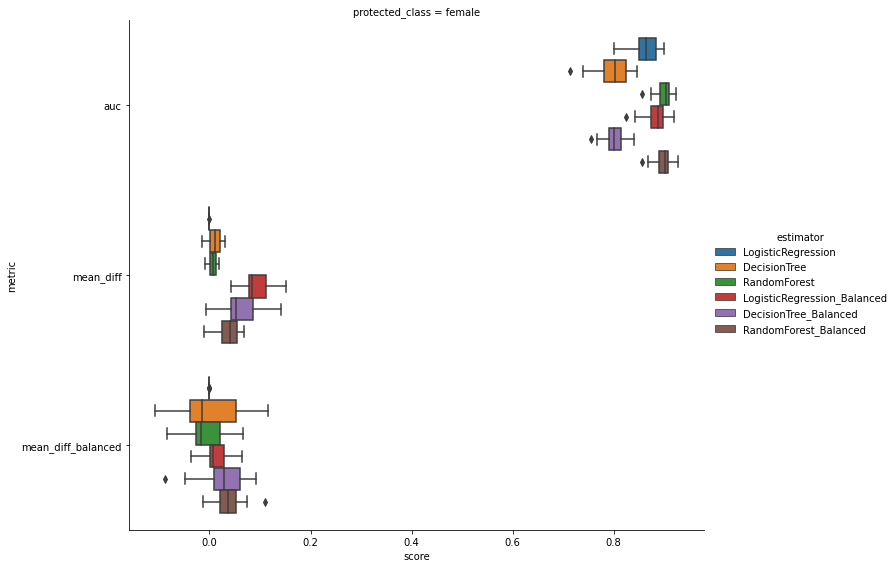

## Explore Influence  of Imbalance Dataset on  Fairness

### Measuring Potential Discrimination

Firstly, we use  **mean difference** as our measure of potential discrimination with respect to a binary target variable **credit risk** and two protected classes **sex** .

This metric belongs to a class of group-level discrimination measures that captures differences in outcome between populations, e.g. `female` vs. `male` . And we compute this metric on the original dataset.

```markdown
Mean Difference: 1.46 - 95% CI [-0.03, 2.94]
Normalised Mean Difference: 1.88 - 95% CI [0.39, 3.37]
```

Below we use `StratifiedKFold` for 5-fold validation so that we can partition our data according to the protected class of interest and train the the following models:

1. *LogisticRegression*

2. *DecisionTreeClassifier*

3. *RandomForestClassifier*

4. *LogisticRegression_Balanced*

5. *DecisionTreeClassifier_Balanced*

6. *RandomForestClassifier_Balanced*

   ```python
   LOGISTIC_REGRESSION = LogisticRegression(
       penalty="l2", C=0.001)
   DECISION_TREE_CLF = DecisionTreeClassifier(
       criterion="entropy", max_depth=10, min_samples_leaf=10, max_features=10)
   RANDOM_FOREST_CLF = RandomForestClassifier(
       criterion="entropy", n_estimators=50, max_depth=10, max_features=10,
       min_samples_leaf=10)
   
   LOGISTIC_REGRESSION_Balanced = LogisticRegression(
       penalty="l2", C=0.001, class_weight="balanced")
   DECISION_TREE_CLF_Balanced = DecisionTreeClassifier(
       criterion="entropy", max_depth=10, min_samples_leaf=10, max_features=10,
       class_weight="balanced")
   RANDOM_FOREST_CLF_Balanced = RandomForestClassifier(
       criterion="entropy", n_estimators=50, max_depth=10, max_features=10,
       min_samples_leaf=10, class_weight="balanced")
       
   estimators = [
           ("LogisticRegression", LOGISTIC_REGRESSION),
       ("DecisionTree", DECISION_TREE_CLF),
       ("RandomForest", RANDOM_FOREST_CLF),
       ("LogisticRegression_Balanced", LOGISTIC_REGRESSION_Balanced),
       ("DecisionTree_Balanced", DECISION_TREE_CLF_Balanced),
       ("RandomForest_Balanced", RANDOM_FOREST_CLF_Balanced)
   ]
   ```

Note that we construct balanced version of three models, i.e., LogisticRegression, DecisionTree and RandomForest, with a default parameter `class_weight`. For how `class_weight` works: It penalises mistakes in samples of `class[i]` with `class_weight[i]` instead of 1. For instance, given a 0-1 binary classification problem, we have a loss function `loss = 0.5*[loss|Y=0]+0.5*[loss|Y=1]`. If we set `class_weight={ 0:0.8, 1:0.2 } # assume 200 samples with label 0, and 800 samples with label 1`, the loss function will be `loss = 0.5*0.8*[loss|Y=0]+0.5*0.2*[loss|Y=1]`.

We set `class_weight="auto" or "balanced"` , which is equivalent to simply assigning `weight[0] = w0 = 2*N1/(N0+N1) and weight[1] = w1 = 2*N0/(N0+N1)`, where there are N0 data points belonging to class 0 and N1 data points belonging to class 1.

### Preliminary results

Obviously, there are some preliminary results with class_weight in a most straightforward and rude way, and then, more sophisticated techniques for weighting in a sample level instead of class level will be implemented and validated.

#### 1. Construct models using all attributes 

``` python
Training models:
-----------------------------------------
LogisticRegression, fold: 0 1 2 3 4 5 6 7 8 9 10 11 12 13 14 15 16 17 18 19 20 21 22 23 24

DecisionTree, fold: 0 1 2 3 4 5 6 7 8 9 10 11 12 13 14 15 16 17 18 19 20 21 22 23 24

RandomForest, fold: 0 1 2 3 4 5 6 7 8 9 10 11 12 13 14 15 16 17 18 19 20 21 22 23 24

LogisticRegression_Balanced, fold: 0 1 2 3 4 5 6 7 8 9 10 11 12 13 14 15 16 17 18 19 20 21 22 23 24

DecisionTree_Balanced, fold: 0 1 2 3 4 5 6 7 8 9 10 11 12 13 14 15 16 17 18 19 20 21 22 23 24

RandomForest_Balanced, fold: 0 1 2 3 4 5 6 7 8 9 10 11 12 13 14 15 16 17 18 19 20 21 22 23 24
```

| estimator                   | auc      | mean_diff | mean_diff_Balanced |
| --------------------------- | -------- | --------- | ------------------ |
| DecisionTree                | 0.798433 | 0.018205  | 0.019376           |
| DecisionTree_Balanced       | 0.800543 | 0.051310  | 0.021330           |
| LogisticRegression          | 0.862700 | -0.000016 | -0.000327          |
| LogisticRegression_Balanced | 0.885321 | 0.091049  | 0.013597           |
| RandomForest                | 0.899339 | 0.004725  | 0.007566           |
| RandomForest_Balanced       | 0.901759 | 0.040864  | 0.028137           |


