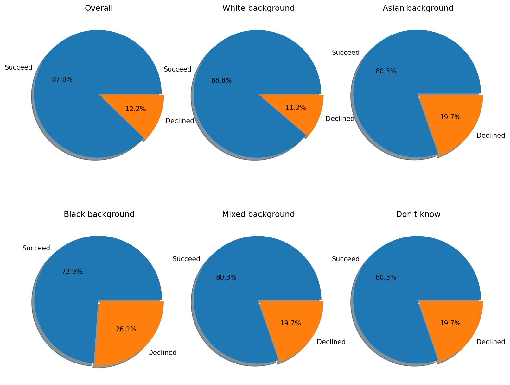
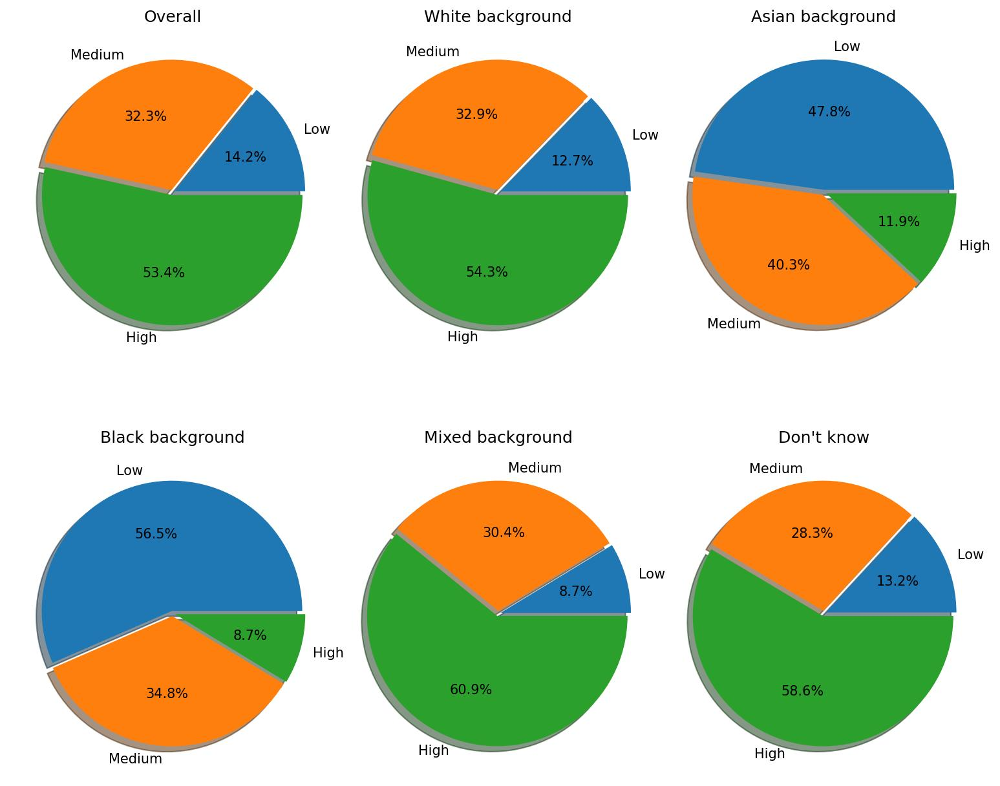
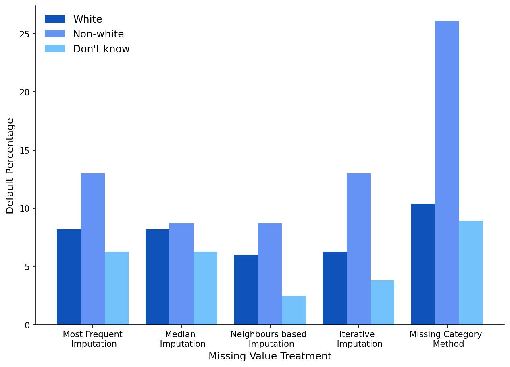
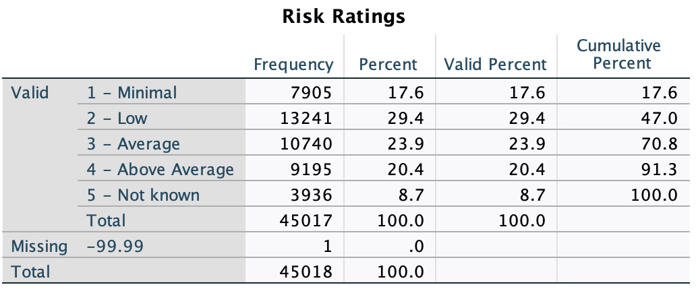

# Recent Progress

## Preliminary data analysis

We used the latest questionnaire data, downloaded from a public UK data service, relating to small and medium-sized businesses (SMEs). The raw data includes information on over 45,018 survey results between 2018 and 2020 with almost 153 questions, including the current financial status and their banking relationships. There are some features with a high proportion of missing values, and any technique to impute them will most likely result in inaccurate and biased results.

### Identify Target Variable

Based on the understanding of the data, our target variable would be a new crafted variable `outcome`, as results are saved as different variables in terms of different financial products. The variable `outcome` incorporate the final results of all financial products, including overdraft and loan.

Additionally, we have the following application status values:

1. You were offered the facility you wanted and took it
2. You took the (PRODUCT) after issues, for example with the terms and conditions or the amount offered
3. `You took a different finance product from the (BANK/FINANCE PROVIDER)`
4. You were offered finance by (BANK/FINANCE PROVIDER) but decided not to take it
5. You were turned down for finance by (BANK/FINANCE PROVIDER)
6. You are waiting to hear

We keep the data, the status of which belongs to 1-5, and dispose of those with a missing and unknown outcome. Moreover, we classify loans with loan status 5 (turned down) as being in default (or 0). The other values 1-4 will be classified as good (or 1), whether or not to take them. However, there is a little bit of confusion about taking a different finance product. 

| outcome | amount | proportion |
| :-----: | :----: | :--------: |
|  good   |  2010  |  0.044649  |
| default |  252   |  0.005598  |
| unknown |  167   |  0.003710  |
| missing | 42589  |  0.946044  |

### Data Split

As we can see, we have 2262 samples with the final outcome in total. Then we split our data into the following sets: training (80%) and test (20%). We will perform Repeated Stratified k Fold testing on the training test to preliminary evaluate our model. In contrast, the test set will remain untouched till the final model evaluation. This approach follows the best model evaluation practice.

## Data Processing 

### Data cleaning

Firstly, we completed some data cleaning tasks on both the training and test sets. We show some initial data exploration about gender and ethnicity w.r.t. final outcome. 

Interestingly, Fig. 1 shows the final outcome for the owners' gender. As we can see, female owners have a more chance of securing a financial product, while male owners would be more pessimistic about their main bank treating them fairly.

Fig. 1. The final outcome with respect to the gender of the business owner.

Fig. 2. To what extent, trust the MAIN BANK to treat them fairly.

On the other hand, when considering the ethnic background, we divide the background category into five classes, i.e., white background, Asian background, black background, and mixed background. Loan applications with a black background have the highest probability of default, while businesses with white backgrounds are the most likely to secure financial products successfully in Fig. 3. Besides, the other backgrounds have an equal chance of loans. Similarly, the owners with the black background gave the least score on the treatment of their MAIN BANK in Fig. 4.

Fig. 3. The final outcome with respect to the ethnic background of the business owner.

Fig. 4. To what extent, trust the MAIN BANK to treat them fairly.

### Feature engineering

Next up, we performed feature selection to identify the most suitable features for our binary classification problem.

Weight of Evidence (WoE) and Information Value (IV) are used for feature engineering and selection and are extensively used in the credit scoring domain.

WoE is a measure of the predictive power of an independent variable in relation to the target variable. It measures the extent a specific feature can differentiate between target classes, in our case: good and bad customers.

IV assists with ranking our features based on their relative importance.

#### Weight of Evidence (WoE)
The formula to calculate WoE is as follows:
$$
W o E_i=\ln \left(\frac{\% \text { of good }}{\% \text { of default }}\right)
$$

Calculate WoE for each unique value (bin) of a categorical variable, e.g., for each gender: Men, gender: Women, etc.

Once WoE has been calculated for each bin of both categorical and numerical features, combine bins as per the following rules (called coarse classing)

#### Information Value (IV)
IV is calculated as follows:
$$
I V=\sum(\% \text { of good }-\% \text { of default }) \times W o E
$$

By convention, the values of IV in credit scoring are interpreted as follows:
| Information Value      | Variable Predictability |
| :---------: | :---------: |
| less than 0.02  | Not useful for prediction  |
| 0.02 to 0.1   | Weak predictive power        |
| 0.1 to 0.3   | Medium predictive power       |
| 0.3 to 0.5   | Strong predictive power       |
| greater than 0.5   | Suspicious predictive power |

Finally, we updated the predictability of each variable in the variable list.xlsx, and variables with no useful predictability are excluded for next our classification task.

## Preliminary Experiments

Finally, we are attempting to do some preliminary experiments and show some initial results when we do several imputation methods of missing values. We fit a `LOGISTIC` regression model on our training set and evaluate it using k-fold cross-validation. 

1. Imputing the data using ***Most Frequent Imputation***: our AUROC on the test set comes out to **0.9408** with a Gini of **0.8815**.
2. Imputing the data using ***Median Imputation***: our AUROC on the test set comes out to **0.9405** with a Gini of **0.8810**.
3. Imputing the data using ***Neighbours based Imputation***: our AUROC on the test set comes out to **0.8776** with a Gini of **0.7552**.
4. Imputing the data using ***Iterative Imputation***. The final method of imputation is iterative imputation based on a regression model. The idea is to iterate over columns and create a new modelling task: predict this column given all the other columns. Furthermore, our AUROC and Gini are **0.8542** and **0.7082**, respectively.
5. Except data imputation methods, we do a crude process, ***Missing Category*** method for missing values, which will treated as a separate category by itself. We create another category for the missing values and use them as a different level. Therefore, we obtain the performance of the classifier i.e., AUROC is **0.9632** and Gini is **0.9264**.

As we can see, given the high proportion of missing values, any technique to impute them will most likely result in inaccurate results.

### Fairness Through  Unawareness

Simply remove these sensitive attributes, thus the classifier is unaware of the sense of attributes directly.

Fig. 5. Classifiers' accuracy w.r.t. the ethnic background of the business owner over five missing value treatments.

Even though the sensitive attribute was removed, classifiers still failed to be unbiased against certain races. As we can see, different methods for dealing with missing values affect the performance of classifiers of different races in Fig. 5; the default rate of businesses with non-white backgrounds is higher than those with white backgrounds in the test set over all predictors with different missing value treatments in Fig. 6. Therefore, we have concerns about non-white races for SME data since all predictors have demonstrated poor performance and higher default rates for those businesses with non-white backgrounds.

Fig. 6. Default rates of different ethnic backgrounds of business owners in the testing set.

## Next Steps

1. We have completed some preliminary experiments in terms of data imputation methods, which negatively affect the prediction accuracy in our ***DEFAULT*** classification task. And we have enough evidence to concern SME, owners of which have non-white background, due to worse prediction accuracy, higher default rate as well.  

2. The raw data includes over 45,018 surveys, but there are only 2,262 surveys that provided their final outcome regarding their overdraft or loan. Besides, a pretty limited number of data samples have ***ethnic minority backgrounds*** among the 2,262 samples, which might not be convincing. So, we need to think about how to utilise the other data to improve fairness of predictors. I have the following potential solutions,

   (1) Intuitively, we can make the most of unlabelled data using semi-supervised learning, that is, generating pseudo labels to predict labels for unlabelled data to obtain new training datasets. Then, we can do traditional fair machine learning on this augmented dataset.

   (2) We can generate a new loss function based on counterfactual fairness, which means that the predictor is counterfactual fair for individuals if predictions in real world scenario and in counterfactual scenario are the same. Specifically, we can construct a optimisation objective that is minimising the prediction discrimination of the sensitive attribute. Finally, our goal will be to learn a classifier to optimise three main objectives, the classification accuracy, common fairness loss and prediction discrimination of unlabelled data.

3. We may consider another attribute, i.e., `risk ratings` with four levels (i.e., minimal, low, average and above average), as our target label instead of the final outcome, with only 3936 missing values out of 45,018 surveys. Of course, we are able to easily transfer the above procedures to this classification task with four-class output.

   
