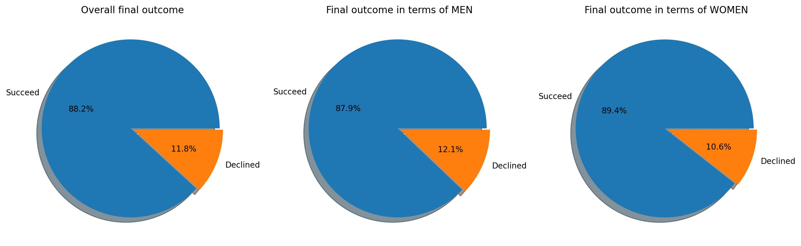
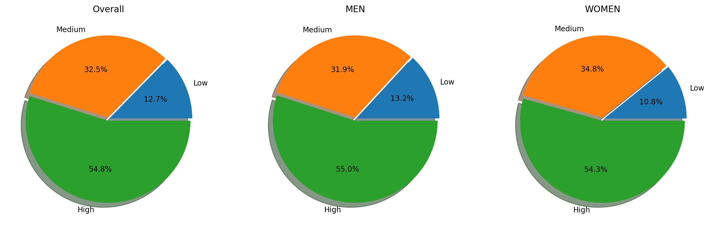
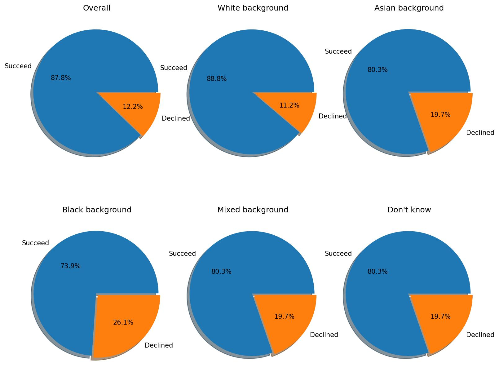
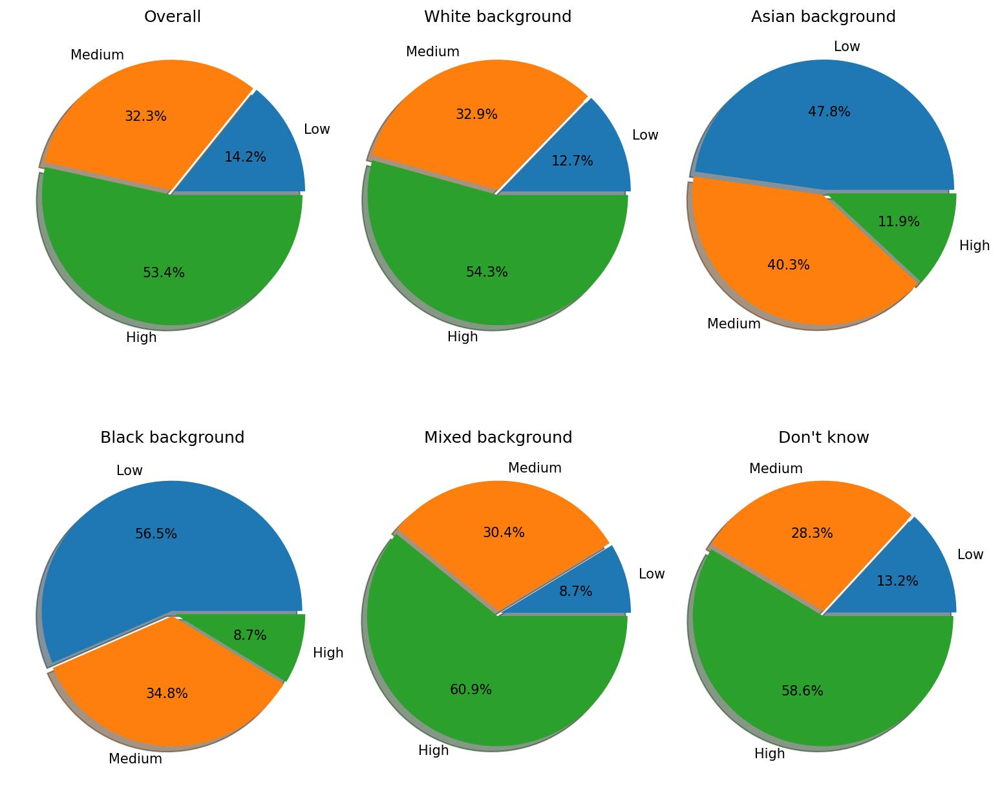

# Progress Report

## Preliminary data analysis

We used the latest questionnaire data, downloaded from a public UK data service, that relates to small and medium-sized businesses (SMEs). The raw data includes information on over 45,018 survey results between 2018 and 2020 with almost 153 questions, including the current financial status and their banking relationships. There are some features with the high proportion of missing values, and any technique to impute them will most likely result in inaccurate and biased results.

### Identify Target Variable

Based on the understanding of the data, our target variable would be a new crafted variable `outcome`, as results are saved as different features in terms of application types.

Additionally, we have the following loan status values

1. You were offered the facility you wanted and took it
2. You took the (PRODUCT) after issues, for example with the terms and conditions or the amount offered
3. `You took a different finance product from the (BANK/FINANCE PROVIDER)`
4. You were offered finance by (BANK/FINANCE PROVIDER) but decided not to take it
5. You were turned down for finance by (BANK/FINANCE PROVIDER)
6. You are waiting to hear

We keep the data, the status of which belongs to 1-5, and dispose of those with a missing and unknown outcome. Moreover, we classify loans with loan status 5 (turned down) as being in default (or 0), and the other values 1-4 will be classified as good (or 1)，whether or not to take it. However, there is a little bit of confusion about taking a different finance product. 

| outcome | amount | proportion |
| :-----: | :----: | :--------: |
|  good   |  2010  |  0.044649  |
| default |  252   |  0.005598  |
| unknown |  167   |  0.003710  |
| missing | 42589  |  0.946044  |

### Data Split

As we can see, we have 2262 samples with the final outcome in total. Then we split our data into the following sets: training (80%) and test (20%). We will perform Repeated Stratified k Fold testing on the training test to preliminary evaluate our model while the test set will remain untouched till final model evaluation. This approach follows the best model evaluation practice.

## Data Processing 

### Data cleaning

Firstly, we completed some data cleaning tasks on both the training and test sets. We show some initial data exploration about gender and ethnicity w.r.t. final outcome. 

Interestingly, Fig. 1 shows the final outcome for the owners' gender. As we can see, female owners have a more chance of securing a financial product, while male owners would be more pessimistic about their main bank treating them fairly.

Fig. 1. The final outcome with respect to the gender of the owner of the business.

Fig. 2. To what extend, trust the MAIN BANK to treat them fairly.

On the other hand, when considering the ethnic background, we divide the background category into five classes, i.e., white background, Asian background, black background, and mixed background. Loan applications with a black background have the highest probability of default, while businesses with white backgrounds are the most likely to successfully secure the financial products in Fig. 3. Besides, the other backgrounds have an equal chance of loans. Similarly, the owners with the black background gave the least score on the treatment of their MAIN BANK in Fig. 4.

Fig. 3. The final outcome with respect to the ethnic background of the owner of the business.

Fig. 4. To what extend, trust the MAIN BANK to treat them fairly.

### Feature engineering

Next up, we performed feature selection to identify the most suitable features for our binary classification problem.

Weight of Evidence (WoE) and Information Value (IV) are used for feature engineering and selection and are extensively used in the credit scoring domain.

WoE is a measure of the predictive power of an independent variable in relation to the target variable. It measures the extent a specific feature can differentiate between target classes, in our case: good and bad customers.

IV assists with ranking our features based on their relative importance.

#### Weight of Evidence (WoE)
The formula to calculate WoE is as follow:
$$
W o E_i=\ln \left(\frac{\% \text { of good }}{\% \text { of default }}\right)
$$

Calculate WoE for each unique value (bin) of a categorical variable, e.g., for each of gender: Men, gender: Women, etc.

Once WoE has been calculated for each bin of both categorical and numerical features, combine bins as per the following rules (called coarse classing)

#### Information Value (IV)
IV is calculated as follows:
$$
I V=\sum(\% \text { of good }-\% \text { of default }) \times W o E
$$

By convention, the values of IV in credit scoring is interpreted as follows:
| Information Value      | Variable Predictability |
| :---------: | :---------: |
| less than 0.02  | Not useful for prediction  |
| 0.02 to 0.1   | Weak predictive power        |
| 0.1 to 0.3   | Medium predictive power       |
| 0.3 to 0.5   | Strong predictive power       |
| greater than 0.5   | Suspicious predictive power |

Finally, we updated the predictability of each variable in the variable list.xlsx, and variables with not useful predictability are excluded for next our classification task.

## Model Training and Testing

Finally, we are attempting to do some preliminary experiments. We fit a LASSO regression model on our training set and evaluate it using k-fold cross validation. And our AUROC on test set comes out to 0.9500 with a Gini of 0.8999 both being considered as quite acceptable evaluation scores.

Next, we will consider the effects of different imputation algorithms on the classification task, and we consider the ethnic background as a sensitive attribute with 340 missing values out of 2322 samples. AUROC 0.8509, and Gini 0.7018

1.基本的想法 扩大数据集 （数据比较少， ethic比较少，单独考虑第三方risk评估）再对比一下是否fairness

2.讨论imputation 方法对这个的影响）
